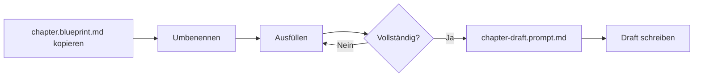

# Blueprints (Intent vor Text)

Dieses Verzeichnis enthält **strukturelle Vorlagen** (Blueprints) für verschiedene Artefakt-Typen im Buch "The PDD Manifesto".

---

## Philosophie

> "Kein Kapitel ohne Blueprint."  
> — llms.txt, Regel #4

Ein Blueprint ist **kein Outline**, sondern ein **Planungsartefakt**, das Intent, Struktur, Claims und Erfolgskriterien definiert, **bevor** Prosa entsteht.

### Warum Blueprints?

Blueprints erzwingen:
- ✅ **Intent-Definition:** Warum existiert dieses Artefakt?
- ✅ **Strukturelle Klarheit:** Was sind die Abschnitte?
- ✅ **Fakten-Disziplin:** Welche Claims müssen geprüft werden?
- ✅ **Qualitätskriterien:** Was sind die Takeaways?

**Ohne Blueprint:** Vage Prosa, inkonsistente Struktur, fehlende Claims.  
**Mit Blueprint:** Klare Spezifikation, reproduzierbare Qualität, auditierbare Artefakte.

---

## Blueprint-Typen

### 1. **chapter.blueprint.md** (Kapitel)
**Zweck:** Definiert die Struktur eines Buchkapitels.

**Verwendet in:**
- Alle 15 Kapitel des Buches (siehe `toc.yml`)

**Prompt-Integration:**
- Input für: `blueprint-fill.prompt.md` (ausfüllen)
- Input für: `chapter-draft.prompt.md` (Draft erzeugen)
- Validierung via: `critic.prompt.md`

**Struktur:**
- Kapitel-Metadaten (ID, Titel, Teil, Status, Zielgruppe)
- Intent (Frage, Problem, Erkenntnis)
- Kernthese (2–5 Sätze)
- Struktur/Outline (3–6 Abschnitte)
- Beispiel/Szene/Case Study
- Claims (prüfpflichtige Aussagen)
- Checkliste (5–8 Punkte)
- Takeaways (3–7 Punkte)
- Offene Fragen (optional)
- Notizen/TODOs

**Beispiel-Anwendung:**
```
1. Kopiere chapter.blueprint.md
2. Benenne um: 01-prompt-als-spezifikation.blueprint.md
3. Fülle aus (manuell oder via blueprint-fill.prompt.md)
4. Validiere Vollständigkeit
5. Nutze als Input für chapter-draft.prompt.md
```

---

### 2. **pattern.blueprint.md** (Architektur-Pattern)
**Zweck:** Definiert die Struktur eines PDD-Architektur-Patterns.

**Verwendet in:**
- Kapitel in Teil III (Architektur & Patterns)
- Eigenständige Pattern-Dokumentation

**Prompt-Integration:**
- Kein dedizierter Prompt (noch), aber folgt gleicher Logik wie `chapter-draft.prompt.md`

**Struktur:**
- Pattern-Metadaten (Name, Kategorie, Status, Verwandte Patterns)
- Intent (Problem, Kontext, Notwendigkeit)
- Motivation/Problem Statement (Symptome, Risiken, Fehlannahmen)
- Lösung (Kerngedanke, Struktur, Mechanik, Regeln)
- Beispiel/Anwendungsszenario
- Anti-Pattern (häufige Fehler, Missverständnisse)
- Claims
- Checkliste (5–8 Punkte)
- Takeaways (3–7 Punkte)
- Notizen/TODOs

**Unterschied zu Kapitel-Blueprint:**
- Fokus auf **Architektur-Denken** (Pattern vs. Prosa)
- Anti-Pattern-Sektion (was NICHT tun)
- Kategorie-Klassifizierung (Architektur, Workflow, Prompting, Governance)

**Beispiel-Anwendung:**
```
Pattern: "Disposable Code"
→ Blueprint definiert: Problem (Legacy-Code), Lösung (Code neu generieren statt patchen), 
   Anti-Pattern (Code manuell pflegen), Beispiel (Boilerplate-Generierung)
```

---

### 3. **case-study.blueprint.md** (Fallstudie)
**Zweck:** Definiert die Struktur einer realen oder realistischen Fallstudie.

**Verwendet in:**
- Kapitel in Teil V (Praxisfälle & Ausblick)
- Als Beispiel-Abschnitte in Kapiteln

**Prompt-Integration:**
- Input für: `example-generator.prompt.md` (Typ: Case Study)

**Struktur:**
- Case-Metadaten (Titel, Kontext, Status, Relevante Patterns)
- Ausgangssituation (vor der Veränderung)
- Herausforderungen (technisch, organisatorisch, kulturell)
- Intervention/Vorgehen (wie wurde PDD angewendet?)
- Ergebnisse (Verbesserungen, Metriken, reduzierte Risiken)
- Learnings (was funktionierte, was nicht, was beim nächsten Mal anders?)
- Claims
- Takeaways (3–7 Punkte)
- Notizen/TODOs

**Unterschied zu Kapitel-Blueprint:**
- Fokus auf **reale Anwendung** (nicht Theorie)
- Learnings-Sektion (Reflexion)
- Kontext-Beschreibung (Unternehmen, Team, Branche)

**Beispiel-Anwendung:**
```
Case Study: "Team X migriert Legacy-System mit PDD"
→ Blueprint definiert: Ausgangssituation (monolithischer Code, keine Tests),
   Vorgehen (Prompt-Blueprints für Modularisierung), Ergebnisse (80% weniger Tech Debt),
   Learnings (Versionierung war entscheidend)
```

**Hinweis:** Falls die Fallstudie **fiktiv** ist, muss das explizit markiert werden:
```markdown
**Hinweis:** Dieses Beispiel ist fiktiv, aber basiert auf realen Mustern.
```

---

### 4. **scene.blueprint.md** (Erzählerische Szene)
**Zweck:** Definiert kurze narrative Szenen für Kapitel-Einstiege oder Illustrationen.

**Verwendet in:**
- Als Kapitel-Einstieg (anstelle von abstraktem Text)
- Als Beispiel-Abschnitt (emotionaler als Code-Beispiel)

**Prompt-Integration:**
- Input für: `example-generator.prompt.md` (Typ: Szene)

**Struktur:**
- Szenen-Metadaten (Titel, Kontext, Status, Kapitelzuordnung)
- Zweck der Szene (Erkenntnis, Emotion, Spannung)
- Beteiligte Rollen (Entwickler:in, Architekt:in, etc.)
- Ausgangssituation (Setting, was passiert)
- Konflikt/Wendepunkt (was eskaliert, Fehlannahme)
- Auflösung/Erkenntnis (was wird klar, wie führt es zur These)
- Claims (falls Fakten enthalten)
- Takeaways (2–5 Punkte)
- Notizen/TODOs

**Unterschied zu Case Study:**
- **Szene = narrativ, kurz** (1–3 Absätze)
- **Case Study = dokumentarisch, ausführlich** (mehrere Abschnitte)

**Beispiel-Anwendung:**
```
Szene: "Sprint-Review: Warum dauert das Feature 3 Wochen statt 3 Tage?"
→ Blueprint definiert: Rollen (Alex, Sam, Taylor), Konflikt (LLM-Code hatte keine Tests),
   Erkenntnis (ohne Struktur führt KI zu "Vibe Coding")
```

---

## Workflow: Wie verwende ich Blueprints?

### Standard-Workflow (Kapitel)



**Schritt-für-Schritt:**

1. **Kopieren**
   ```bash
   cp manuscript/_blueprints/chapter.blueprint.md \
      manuscript/_blueprints/01-prompt-als-spezifikation.blueprint.md
   ```

2. **Ausfüllen** (zwei Optionen)
    - **Option A (Manuell):** Öffne Blueprint, fülle aus
    - **Option B (Assistiert):** Nutze `blueprint-fill.prompt.md` (empfohlen)

3. **Validieren**
    - Checklist am Ende des Blueprints durchgehen
    - Alle Pflichtfelder ausgefüllt?
    - Claims notiert?

4. **Draft erzeugen**
    - Blueprint als Input für `chapter-draft.prompt.md` nutzen
    - Draft entsteht deterministisch aus Blueprint

5. **Review**
    - Draft via `critic.prompt.md` validieren
    - Blueprint vs. Draft abgleichen

---

## Best Practices

### 1. **Blueprint vor Prosa** (nicht verhandelbar)
❌ **Falsch:** "Ich schreibe mal ein Kapitel, Blueprint kommt später."  
✅ **Richtig:** Blueprint ausfüllen → validieren → Draft erzeugen.

**Warum?**
- Ohne Blueprint: Inkonsistente Struktur, fehlende Claims, vage Thesen
- Mit Blueprint: Deterministisch, reproduzierbar, auditierbar

---

### 2. **Blueprints sind lebendig**
Blueprints ändern sich während der Arbeit:
- **Draft-Phase:** Blueprint wird konkretisiert
- **Review-Phase:** Blueprint wird gegen Draft abgeglichen
- **Final-Phase:** Blueprint ist Dokumentation des Intents

**Regel:** Blueprint und finales Kapitel müssen konsistent sein.

---

### 3. **Blueprints versionieren**
Blueprints sind Teil des Git-Repositories:
- Jede Änderung committen
- Commit-Message: "feat: add blueprint for 01-prompt-als-spezifikation"
- Änderungen nachvollziehbar halten

---

### 4. **Blueprints sind diffbar**
Blueprints sind Markdown → diffs sind lesbar:
```diff
# 3) Kernthese
- Ein Prompt ist eine Anfrage.
+ Ein Prompt ist eine Spezifikation, kein Wunsch.
```

---

### 5. **Ein Blueprint = eine Datei**
Für jedes Artefakt eine eigene Blueprint-Datei:
```
_blueprints/
├── 01-prompt-als-spezifikation.blueprint.md
├── 02-prompt-architektur.blueprint.md
├── pattern-disposable-code.blueprint.md
├── case-legacy-migration.blueprint.md
└── scene-sprint-review.blueprint.md
```

**Nicht:**
```
_blueprints/alle-kapitel.md  ❌ (zu groß, nicht diffbar)
```

---

## Häufige Fehler (Anti-Patterns)

### ❌ Anti-Pattern 1: Blueprint auslassen
**Problem:** "Ich weiß, was ich schreibe, brauche keinen Blueprint."  
**Folge:** Inkonsistente Struktur, fehlende Claims, vage Thesen.  
**Lösung:** Immer Blueprint ausfüllen, auch wenn es "klar" scheint.

---

### ❌ Anti-Pattern 2: Blueprint zu abstrakt
**Problem:** Blueprint mit Platzhaltern lassen ("...").  
**Folge:** Draft ist ebenso vage.  
**Lösung:** Blueprint konkret ausfüllen, bevor Draft startet.

**Schlecht:**
```markdown
# 3) Kernthese
...
```

**Besser:**
```markdown
# 3) Kernthese
Ein Prompt ist keine natürlichsprachliche Anfrage, sondern eine formale 
Spezifikation eines Outputs. Wie ein API-Vertrag definiert er Eingaben, 
Constraints, Ausgabeformat und Erfolgskriterien.
```

---

### ❌ Anti-Pattern 3: Blueprint und Draft driften auseinander
**Problem:** Blueprint sagt A, Draft sagt B.  
**Folge:** Inkonsistenz, Reviewer verwirrt.  
**Lösung:** Blueprint ist Source of Truth. Wenn Draft abweicht, Blueprint aktualisieren.

---

### ❌ Anti-Pattern 4: Claims vergessen
**Problem:** Blueprint hat Abschnitt "Claims", bleibt aber leer.  
**Folge:** Draft enthält ungeprüfte Fakten.  
**Lösung:** Claims während Blueprint-Phase sammeln, nicht später.

---

## Troubleshooting

### Problem: "Ich weiß nicht, was ich in Blueprint schreiben soll."
**Lösung:**
1. Nutze `blueprint-fill.prompt.md` → interaktiver Assistent
2. Schau dir Beispiel-Blueprints an (in ausgefüllten Kapiteln)
3. Beantworte die Leitfragen im Blueprint

---

### Problem: "Blueprint ist zu lang/komplex."
**Lösung:**
- Blueprints sind absichtlich detailliert → Qualität entsteht durch Struktur
- Du kannst Abschnitte auslassen, wenn sie nicht relevant sind (z.B. "Offene Fragen")
- Aber: Pflichtabschnitte (Kernthese, Checkliste, Takeaways) niemals weglassen

---

### Problem: "Ich habe Blueprint ausgefüllt, aber Draft passt nicht."
**Lösung:**
1. Prüfe: Ist Blueprint konkret genug?
2. Nutze `critic.prompt.md` → validiert Blueprint vs. Draft
3. Aktualisiere Blueprint, wenn Intent sich geändert hat

---

## Versionierung

Alle Blueprint-Templates folgen Semantic Versioning:
- **MAJOR:** Breaking Changes (Struktur ändert sich grundlegend)
- **MINOR:** Neue Abschnitte (z.B. neue Metadaten-Felder)
- **PATCH:** Klarstellungen, Beispiele (keine strukturellen Änderungen)

**Aktuelle Versionen:**
- `chapter.blueprint.md`: **v1.1.0** (erweitert mit Inline-Beispielen)
- `pattern.blueprint.md`: **v1.1.0** (erweitert mit Inline-Beispielen)
- `case-study.blueprint.md`: **v1.1.0** (erweitert mit Inline-Beispielen)
- `scene.blueprint.md`: **v1.1.0** (erweitert mit Inline-Beispielen)

---

## Weiterführende Dokumentation

- **llms.txt:** Verhaltensregeln für LLMs (inkl. "Blueprint first")
- **workflow-paper.md:** Zeitbasierte Arbeitsanleitung, Definition of Done
- **ARCHITECTURE.md:** Repository-Architektur, Artefakt-Typen
- **_prompts/README.md:** Wie Prompts mit Blueprints interagieren

---

## Lizenz

Diese Blueprints sind Teil des Buchprojekts "The PDD Manifesto" und unterliegen der Repository-Lizenz.

---

**Version:** 1.0.0  
**Letzte Aktualisierung:** 2026-02-25