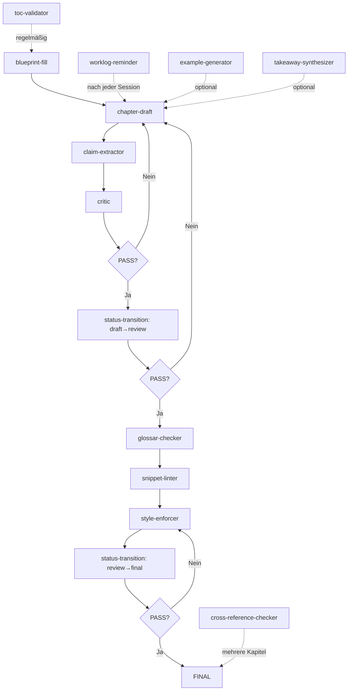

# Prompts (First-Class Artifacts)

Dieses Verzeichnis enthält **versionierte Prompts** für die strukturierte Arbeit am Buch "The PDD Manifesto".

Prompts sind hier **keine Ad-hoc-Anfragen**, sondern **First-Class Artifacts** – sie werden wie Code behandelt: versioniert, reviewed, getestet.

---

## Philosophie

> "Ein Prompt ist eine Spezifikation, kein Wunsch."

Jeder Prompt in diesem Verzeichnis definiert:
- **Intent:** Was soll erreicht werden?
- **Input:** Was wird benötigt?
- **Output:** Was wird erzeugt?
- **Constraints:** Was darf/muss (nicht) getan werden?
- **Validation:** Wie wird der Output geprüft?

---

## Wie verwende ich diese Prompts?

### Option A: Manuell (Copy & Paste)
1. Öffne den relevanten Prompt (z.B. `chapter-draft.prompt.md`)
2. Kopiere den gesamten Inhalt
3. Füge ihn in dein LLM-Tool ein (ChatGPT, Claude, GitHub Copilot Chat, etc.)
4. Füge den erforderlichen Input hinzu (z.B. Blueprint, Kapitel-Draft)
5. Führe aus

### Option B: Custom GPT (empfohlen für wiederkehrende Aufgaben)
1. Erstelle einen Custom GPT in ChatGPT
2. Lade den Prompt als Knowledge Base hoch
3. Referenziere den Prompt in der Custom Instruction
4. Verwende den Custom GPT für alle Sessions

### Option C: API/Script (für Automatisierung)
1. Nutze die Prompts als System-Prompts in API-Calls
2. Beispiel (Python + OpenAI API):
   ```python
   with open("manuscript/_prompts/critic.prompt.md") as f:
       system_prompt = f.read()
   
   response = openai.ChatCompletion.create(
       model="gpt-4",
       messages=[
           {"role": "system", "content": system_prompt},
           {"role": "user", "content": chapter_draft}
       ]
   )
   ```

---

## Prompts (Alphabetisch)

### 📝 **blueprint-fill.prompt.md**
**Zweck:** Unterstütze beim strukturierten Ausfüllen eines leeren Chapter-Blueprints.

**Anwendungsfall:**
- **Wann:** Bevor ein neues Kapitel geschrieben wird
- **Input:** Kapitel-ID, Titel, Teil
- **Output:** Vollständig ausgefülltes Blueprint
- **Workflow:** Schritt 1 vor `chapter-draft.prompt.md`

**Beispiel:**
```
Input: Kapitel-ID "02-prompt-architektur"
Output: Blueprint mit Intent, Kernthese, Outline, Claims, Checkliste, Takeaways
```

---

### 📖 **chapter-draft.prompt.md**
**Zweck:** Erzeuge einen ersten Rohentwurf für ein Kapitel basierend auf einem Blueprint.

**Anwendungsfall:**
- **Wann:** Wenn Blueprint vollständig ist
- **Input:** Ausgefülltes Blueprint, TOC, Optional: Claims/Glossar
- **Output:** Kapitel-Draft (Markdown mit Frontmatter, TL;DR, Kernthese, Beispiel, Checkliste, Takeaways)
- **Workflow:** Schritt 2 nach `blueprint-fill.prompt.md`

**Beispiel:**
```
Input: Blueprint "01-prompt-als-spezifikation"
Output: Kapitel-Draft (status: draft)
```

---

### 🔍 **claim-extractor.prompt.md**
**Zweck:** Extrahiere alle Fakten, Statistiken und Behauptungen aus einem Draft, die als Claims validiert werden müssen.

**Anwendungsfall:**
- **Wann:** Nach dem Schreiben eines Drafts
- **Input:** Kapitel-Draft
- **Output:** Strukturierte Liste von Claims (mit Zeilennummern, Priorität, Quelle [TODO])
- **Workflow:** Schritt 3 nach `chapter-draft.prompt.md`

**Beispiel:**
```
Input: Draft mit Satz "80% der Teams scheitern an unklaren Requirements."
Output: Claim (HIGH Priority): "80% der Teams..." → Quelle [TODO]
```

---

### ✅ **critic.prompt.md**
**Zweck:** Bewerte einen Kapitel-Entwurf objektiv gegen Blueprint, Style Guide und Definition of Done.

**Anwendungsfall:**
- **Wann:** Bevor ein Kapitel von `draft` → `review` wechselt
- **Input:** Kapitel-Draft, Blueprint, Style Guide, DoD
- **Output:** Review-Report mit Score (0–10), Top-5-Problemen, Empfehlungen
- **Workflow:** Quality Gate vor Status-Übergang

**Beispiel:**
```
Input: Draft "01-prompt-als-spezifikation"
Output: Score 6.8/10, 3 Blocker (Claims fehlen, Beispiel fehlt, Platzhalter)
```

---

### 📚 **cross-reference-checker.prompt.md**
**Zweck:** Finde Inkonsistenzen, Widersprüche und Redundanzen zwischen Kapiteln.

**Anwendungsfall:**
- **Wann:** Wenn mehrere Kapitel `review` oder `final` Status erreichen
- **Input:** Mindestens 2 Kapitel, TOC
- **Output:** Report mit Widersprüchen, Redundanzen, fehlenden Referenzen
- **Workflow:** Qualitätssicherung für Gesamtsystem

**Beispiel:**
```
Input: Kapitel 01 + Kapitel 03
Output: Widerspruch gefunden: "Prompts sollten immer versioniert werden" vs. "Versionierung ist optional"
```

---

### 💡 **example-generator.prompt.md**
**Zweck:** Erzeuge konkrete, technische Beispiele, Szenen oder Case Studies basierend auf einem Blueprint.

**Anwendungsfall:**
- **Wann:** Wenn Blueprint Beispiel-Sektion (Abschnitt 5) definiert ist
- **Input:** Blueprint (Abschnitt 5), Kapitel-Kontext
- **Output:** Code-Beispiel / Szene / Case Study / Metapher (strukturiert)
- **Workflow:** Optional während Draft-Erstellung

**Beispiel:**
```
Input: Blueprint fordert "Code-Beispiel: Prompt als API-Vertrag"
Output: Python-Code mit vagem vs. strukturiertem Prompt (15 Zeilen, kommentiert)
```

---

### 📖 **glossar-checker.prompt.md**
**Zweck:** Prüfe Kapitel auf Glossar-Konsistenz und schlage neue Glossar-Einträge vor.

**Anwendungsfall:**
- **Wann:** Während Review oder vor `final`-Status
- **Input:** Kapitel-Draft, Glossar
- **Output:** Report mit Inkonsistenzen, Varianten, neuen Begriff-Kandidaten
- **Workflow:** Qualitätssicherung für Terminologie

**Beispiel:**
```
Input: Draft verwendet "API-Contract", "api contract", "API-Vertrag"
Output: Inkonsistenz gefunden → Vereinheitlichen auf "API Contract" (Glossar-Form)
```

---

### 🔐 **schema.prompt.md**
**Zweck:** Erzeuge ein Prompt-Contract-Schema für wiederholbare Aufgaben im PDD-Kontext.

**Anwendungsfall:**
- **Wann:** Wenn ein neuer Prompt erstellt werden soll
- **Input:** Aufgabenbeschreibung, Optional: Beispiel-Input/Output
- **Output:** Vollständiger Prompt-Contract (Intent, Input, Output, Constraints, Validation, Examples, Anti-Patterns)
- **Workflow:** Meta-Prompt für Prompt-Erstellung

**Beispiel:**
```
Input: "Ich brauche einen Prompt, der Takeaways aus Kapiteln extrahiert"
Output: Vollständiges Template für "takeaway-synthesizer.prompt.md"
```

---

### 🧹 **snippet-linter.prompt.md**
**Zweck:** Validiere Code-Snippets in Kapiteln auf Syntax, Ausführbarkeit, Kommentare und Best Practices.

**Anwendungsfall:**
- **Wann:** Bevor ein Kapitel `final` Status erreicht
- **Input:** Kapitel-Draft mit Code-Snippets
- **Output:** Lint-Report (Syntax-Fehler, fehlende Kommentare, "Foo/Bar"-Beispiele, Best-Practice-Violations)
- **Workflow:** Qualitätssicherung für Code

**Beispiel:**
```
Input: Python-Snippet mit Syntax-Fehler (fehlendes ":")
Output: ERROR: Zeile 4, fehlendes ":" nach if-Statement → Fix vorgeschlagen
```

---

### ✏️ **status-transition.prompt.md**
**Zweck:** Prüfe, ob ein Kapitel bereit ist für einen Status-Übergang (`draft` → `review` → `final`).

**Anwendungsfall:**
- **Wann:** Vor jedem Status-Übergang
- **Input:** Kapitel-Draft, aktueller Status, Ziel-Status
- **Output:** PASS/FAIL mit Checklist (DoD-Kriterien), Blocker-Liste
- **Workflow:** Automatisierter Quality Gate

**Beispiel:**
```
Input: Draft "01-prompt-als-spezifikation", Ziel: "review"
Output: FAIL (7/10 Kriterien erfüllt) → 3 Blocker: Kernthese zu kurz, Beispiel fehlt, Platzhalter
```

---

### 🎨 **style-enforcer.prompt.md**
**Zweck:** Korrigiere ausschließlich Rechtschreibung, Zeichensetzung und minimale Grammatikfehler.

**Anwendungsfall:**
- **Wann:** Bevor ein Kapitel `final` Status erreicht
- **Input:** Kapitel-Draft
- **Output:** Korrigierter Text + Änderungsprotokoll (Orthografie, Interpunktion, Grammatik, Gendern)
- **Workflow:** Letzter Schritt vor `final`

**Beispiel:**
```
Input: "Die Entwikler sind überfordert."
Output: Korrektur: "Die Entwickler:innen sind überfordert." (Orthografie + Gendern)
```

---

### 🎯 **takeaway-synthesizer.prompt.md**
**Zweck:** Erzeuge prägnante Takeaways (3–7 Punkte) aus einem fertiggestellten Kapitel.

**Anwendungsfall:**
- **Wann:** Wenn Kapitel-Draft vollständig ist (vor `review`)
- **Input:** Kapitel-Draft (vollständig)
- **Output:** 3–7 Takeaways (Erkenntnisse, nicht Zusammenfassungen)
- **Workflow:** Optional während Draft-Erstellung oder vor Review

**Beispiel:**
```
Input: Kapitel "01-prompt-als-spezifikation"
Output: 
- "Prompts sind Verträge, keine Anfragen – sie definieren Erfolg, bevor Code entsteht."
- "Ein Prompt ohne expliziten Intent führt zu unvorhersehbaren Ergebnissen."
- ...
```

---

### 📋 **toc-validator.prompt.md**
**Zweck:** Validiere die Konsistenz zwischen `toc.yml` (Single Source of Truth) und den tatsächlichen Kapitel-Dateien.

**Anwendungsfall:**
- **Wann:** Regelmäßig (z.B. vor Build, vor PR)
- **Input:** `toc.yml`, Repository-Struktur
- **Output:** Validation-Report (fehlende Kapitel, Orphan-Kapitel, ID-Inkonsistenzen, Nummerierungs-Probleme)
- **Workflow:** Strukturelle Qualitätssicherung

**Beispiel:**
```
Input: toc.yml definiert "02-technical-debt-bitrot.md", Datei existiert nicht
Output: BLOCKER: Kapitel fehlt → Datei erstellen oder aus TOC entfernen
```

---

### 📝 **worklog-reminder.prompt.md**
**Zweck:** Erzeuge strukturierte Worklog-Einträge basierend auf einer Schreib-Session.

**Anwendungsfall:**
- **Wann:** Nach jeder Schreib-Session
- **Input:** Session-Info (Datum, Zeitbudget, Aufgabe), Optional: Commits, Dateien, Status-Änderungen
- **Output:** Worklog-Eintrag (Ziel, Durchgeführt, Ergebnis, Dateien, Next Steps)
- **Workflow:** Session-Dokumentation

**Beispiel:**
```
Input: Session "Blueprint ausfüllen" (60 min)
Output: Worklog-Eintrag mit Ziel, durchgeführten Aktionen, Ergebnis (✅/⚠️/❌), Next Steps
```

---

## Workflow-Übersicht



---

## Best Practices

### 1. Prompts nie "frei Hand" ändern
- Jede Änderung muss versioniert sein
- Änderungen sollten minimal und begründet sein
- Nutze `schema.prompt.md` für neue Prompts

### 2. Prompts sequenziell anwenden
- `blueprint-fill` → `chapter-draft` → `claim-extractor` → `critic` → ...
- Nicht überspringen (auch wenn es schneller scheint)

### 3. Output immer validieren
- Jeder Prompt hat eine Validation Checklist
- Nutze sie, bevor du den Output akzeptierst

### 4. Feedback-Loop
- Wenn ein Prompt nicht funktioniert: Issue erstellen
- Wenn ein Prompt verbessert werden kann: PR mit Begründung

---

## Versionierung

Alle Prompts folgen Semantic Versioning:
- **MAJOR:** Breaking Changes (Output-Format ändert sich)
- **MINOR:** Neue Features (z.B. neue Validierungs-Regel)
- **PATCH:** Bug-Fixes (z.B. Typo, Klarstellung)

Aktuelle Versionen:
- `blueprint-fill.prompt.md`: v0.1.0
- `chapter-draft.prompt.md`: v0.2.0
- `claim-extractor.prompt.md`: v0.1.0
- `critic.prompt.md`: v0.2.0
- `cross-reference-checker.prompt.md`: v0.1.0
- `example-generator.prompt.md`: v0.1.0
- `glossar-checker.prompt.md`: v0.1.0
- `schema.prompt.md`: v0.2.0
- `snippet-linter.prompt.md`: v0.1.0
- `status-transition.prompt.md`: v0.1.0
- `style-enforcer.prompt.md`: v0.2.0
- `takeaway-synthesizer.prompt.md`: v0.1.0
- `toc-validator.prompt.md`: v0.1.0
- `worklog-reminder.prompt.md`: v0.1.0

---

## Troubleshooting

### Problem: Prompt liefert unerwarteten Output
**Lösung:**
1. Prüfe, ob alle erforderlichen Inputs vorhanden sind
2. Prüfe, ob der Prompt die richtige Version ist
3. Prüfe die Validation Checklist im Prompt
4. Falls weiterhin Probleme: Issue erstellen

### Problem: Prompt ist zu lang für mein LLM-Tool
**Lösung:**
- Nutze ein Modell mit größerem Context Window (z.B. GPT-4 Turbo, Claude 3)
- Oder: Teile den Prompt in Abschnitte und führe sequenziell aus

### Problem: Ich brauche einen neuen Prompt
**Lösung:**
1. Nutze `schema.prompt.md` als Meta-Prompt
2. Beschreibe die Aufgabe
3. Erzeuge den Prompt-Contract
4. Teste ihn
5. PR erstellen

---

## Weiterführende Dokumentation

- **llms.txt**: Verhaltensregeln für LLMs im gesamten Projekt
- **workflow-paper.md**: Zeitbasierte Arbeitsanleitung, Definition of Done
- **ARCHITECTURE.md**: Repository-Architektur, Artefakt-Typen
- **style-guide.md**: Sprache, Stimme, Struktur

---

## Lizenz

Diese Prompts sind Teil des Buchprojekts "The PDD Manifesto" und unterliegen der Repository-Lizenz.

---

**Version:** 1.0.0  
**Letzte Aktualisierung:** 2026-02-25