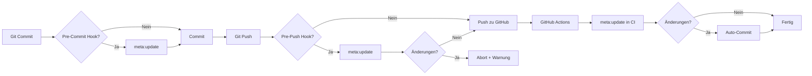

# Scripts

Dieses Verzeichnis enthält **Build- und Meta-Generierungs-Scripts** für das Buchprojekt.

---

## Meta-Generierungs-Scripts (automatisch)

### `generate-changelog.js`
**Zweck:** Generiert `manuscript/_meta/changelog.md` aus Git-Commit-History.

**Verwendung:**
```bash
npm run changelog
```

**Funktionsweise:**
- Liest alle Commits seit letztem Git-Tag
- Gruppiert nach Typ (`feat`, `fix`, `docs`, `chore`)
- Schreibt nach `manuscript/_meta/changelog.md`

**Commit-Format (empfohlen):**
```
feat: add blueprint for chapter 01
fix: correct typo in glossary
docs: update README
chore: update dependencies
```

---

### `generate-pattern-index.js`
**Zweck:** Generiert `manuscript/_meta/pattern-index.md` aus Pattern-Blueprints.

**Verwendung:**
```bash
npm run index:patterns
```

**Funktionsweise:**
- Scannt `manuscript/_blueprints/*pattern*.blueprint.md`
- Extrahiert Metadaten (Name, Status, Kapitel, Verwandte Patterns)
- Generiert strukturierten Index

---

### `generate-case-study-index.js`
**Zweck:** Generiert `manuscript/_meta/case-study-index.md` aus Case-Study-Blueprints.

**Verwendung:**
```bash
npm run index:cases
```

**Funktionsweise:**
- Analog zu `generate-pattern-index.js`
- Scannt `*case-study*.blueprint.md`

---

### `generate-scene-index.js`
**Zweck:** Generiert `manuscript/_meta/scene-index.md` aus Scene-Blueprints.

**Verwendung:**
```bash
npm run index:scenes
```

**Funktionsweise:**
- Analog zu `generate-pattern-index.js`
- Scannt `*scene*.blueprint.md`

---

### `update-book-meta.js`
**Zweck:** Aktualisiert `manuscript/_meta/book.yml` mit Git-Metadaten.

**Verwendung:**
```bash
node scripts/update-book-meta.js
```

**Funktionsweise:**
- `edition`: Aus letztem Git-Tag (z.B. `v0.2.0`)
- `repository`: Aus `.git/config` (remote.origin.url)
- `created`: Aus erstem Git-Commit (falls leer)

---

### `suggest-glossary-terms.js`
**Zweck:** Schlägt neue Glossar-Begriffe vor (schreibt NICHT).

**Verwendung:**
```bash
npm run glossary:suggest
```

**Funktionsweise:**
- Scannt alle `manuscript/**/*.md`
- Findet kapitalisierte Begriffe (z.B. "Prompt-Driven Development")
- Vergleicht mit existierenden Glossar-Einträgen
- Gibt Top-20-Vorschläge aus

**Hinweis:** Definitionen müssen manuell in `glossary.md` eingetragen werden.

---

## Build-Scripts (manuell)

### `build.js`
**Zweck:** Generiert HTML aus Markdown (für GitHub Pages).

**Verwendung:**
```bash
npm run build
```

**Output:** `docs/`

---

### `check.js`
**Zweck:** Validiert Struktur (TOC, Frontmatter, Links).

**Verwendung:**
```bash
npm run check
```

---

### `serve.js`
**Zweck:** Lokaler Dev-Server für `docs/`.

**Verwendung:**
```bash
npm run serve
```

**URL:** http://localhost:8000

---

## Automatisierung

### Lokal (Git-Hooks)

**Pre-Commit Hook** (aggressiv):
```bash
# .git/hooks/pre-commit
npm run meta:update
git add manuscript/_meta/
```

**Pre-Push Hook** (empfohlen):
```bash
# .git/hooks/pre-push
npm run meta:update
# Falls Änderungen → Commit nötig
```

Einrichtung:
```bash
# Pre-Push (empfohlen)
cat > .git/hooks/pre-push << 'EOF'
#!/bin/bash
npm run meta:update
if [ -n "$(git status --porcelain manuscript/_meta/)" ]; then
  echo "⚠️  Meta files changed. Commit and push again."
  exit 1
fi
EOF
chmod +x .git/hooks/pre-push
```

---

### GitHub Actions (CI)

**Workflow:** `.github/workflows/meta-update.yml`

- Läuft bei jedem Push zu `main`
- Generiert Changelog + Indexes + book.yml
- Committed automatisch zurück ins Repo

**Aktivierung:**
- Workflow-Datei committen
- GitHub Actions müssen `write`-Rechte haben:
    - Repository Settings → Actions → General → Workflow permissions → "Read and write permissions"

---

## Troubleshooting

### Problem: `js-yaml` nicht gefunden
**Lösung:**
```bash
npm install
```

---

### Problem: Git-Hook läuft nicht
**Lösung:**
```bash
chmod +x .git/hooks/pre-push
# oder
chmod +x .git/hooks/pre-commit
```

---

### Problem: GitHub Actions committed nicht zurück
**Lösung:**
- Repository Settings → Actions → General → Workflow permissions
- "Read and write permissions" aktivieren

---

## Workflow-Diagramm



---

## Best Practices

1. **Commit-Messages:** Nutze Conventional Commits (`feat:`, `fix:`, `docs:`)
2. **Git-Hook:** Nutze Pre-Push (nicht Pre-Commit) → weniger Friction
3. **GitHub Actions:** Aktiviere für automatische Updates bei jedem Push
4. **Glossar:** Nutze `glossary:suggest` regelmäßig, definiere manuell

---

## Dependencies

- **js-yaml** (^4.1.0): YAML-Parsing für book.yml, toc.yml

Install:
```bash
npm install
```

---

**Version:** 1.0.0  
**Letzte Aktualisierung:** 2026-02-25